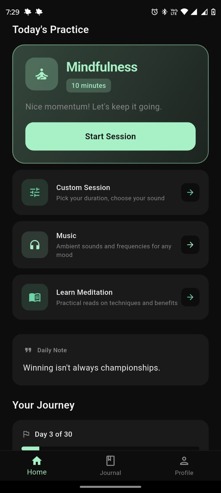
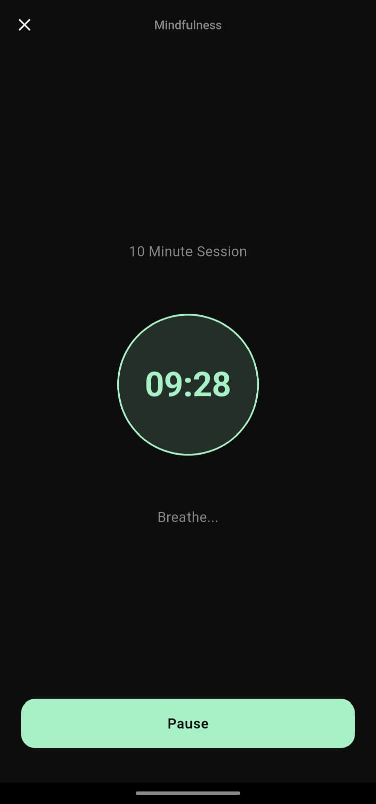
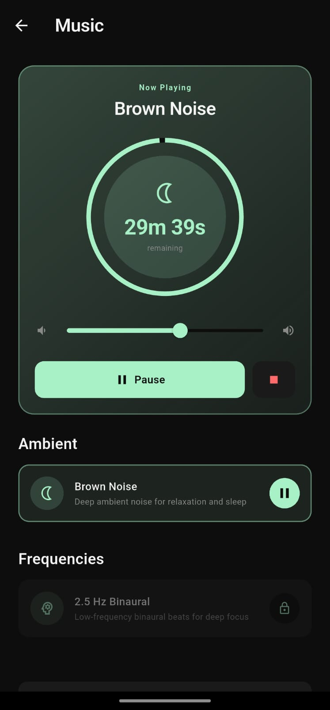
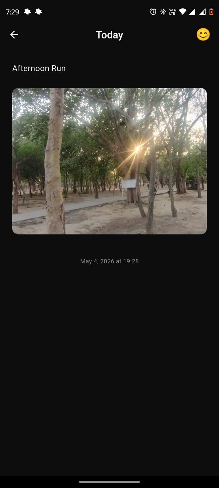
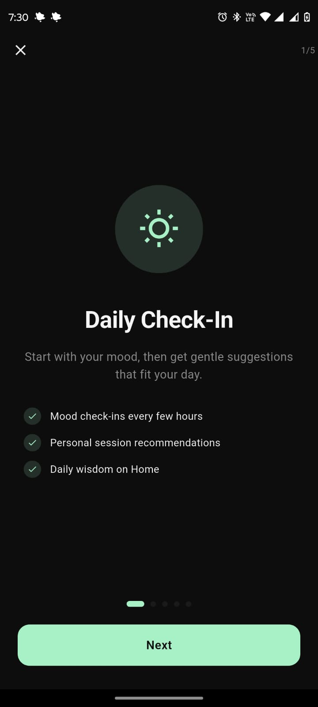
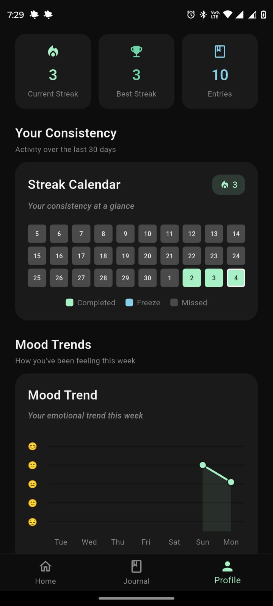

# Stillspace

Stillspace is a dark-themed Flutter mental wellness app for building a consistent mindfulness habit. It combines meditation sessions, guided breathing, background music, mood tracking, journaling, streaks, reminders, progress charts, and offline-first storage.

## Features

### Meditation and Breathing
- Custom meditation timer with 5 to 30 minute sessions
- Gentle start and completion bell
- Optional ambient sound during sessions
- 2.5 Hz binaural focus audio and brown noise relaxation audio
- Guided Wim Hof breathing session with audio-driven countdown

### Music
- Dedicated music section for ambient and frequency tracks
- 15, 30, 60 minute, or open-ended music sessions
- Background playback with lock-screen and notification controls
- Mini player available above the bottom navigation
- Music session timer pauses correctly and locks duration/track changes during active sessions

### Mood, Journal, and Learn
- Mood check-in on app open when needed, with a 2-hour cooldown
- 5-point emoji mood selector
- Reflective journaling with guided prompts and mood tags
- Local-only journal images from camera or gallery
- Offline Learn Meditation section with practical articles
- Daily wisdom card with cached ZenQuotes API fallback and hardcoded offline quotes

### Progress and Consistency
- Streak system for completed meditation sessions or journal entries
- Streak freeze support
- Context-aware reminders and follow-ups
- 30-day streak calendar
- 7-day mood trend chart
- Goal options for 7, 14, 21, or 30 days

### Backup and Offline Support
- Offline-first data storage with Hive
- Optional Google Sign-In
- Firestore sync on changes and once per day on app open
- Local data remains usable without internet

## Screenshots

<div>
  
  
  
</div>

<div>
  
  
  
</div>

## Tech Stack


- Flutter
- Provider
- Hive and hive_flutter
- Firebase Auth
- Cloud Firestore
- flutter_local_notifications
- fl_chart
- just_audio
- just_audio_background
- image_picker
- path_provider
- http

## Project Structure

```text
lib/
  core/
    constants/
    theme/
    utils/
  features/
    home/
    journal/
    learn/
    mood/
    music/
    onboarding/
    profile/
    session/
    settings/
    walkthrough/
  providers/
  services/
  widgets/
  main.dart
assets/
  audio/
  data/
  icon/
test/
```

## Recommendation Engine

Stillspace uses a rule-based recommendation engine that considers:

- mood score
- current streak
- days left in the user's goal
- whether yesterday was missed
- time of day

Current priority order:

1. Goal is close, 3 days or fewer left: urgent focus session
2. Missed yesterday: short calming session
3. Mood is 3 or lower before noon or late evening: Wim Hof breathing
4. Mood is 2 or lower outside those windows: short calming session
5. High mood with strong streak: longer focus session
6. Evening: wind-down session
7. Morning: energizing session
8. Default: standard mindfulness session

## Audio Notes

The app uses `just_audio_background`, which supports a single active background audio player. Stillspace routes music, meditation ambience, bells, and guided breathing through a shared audio player so music and meditation do not fight each other.

The start bell plays before meditation ambience. If `assets/audio/bell-sound.mp3` is replaced with a shorter file at the same path, the app will use it without code changes.

## Setup

### Prerequisites

- Flutter SDK
- Android Studio or VS Code
- Android emulator or Android device
- Firebase project configuration already present in the app

### Install

```powershell
flutter pub get
```

### Run

```powershell
flutter run
```

### Test

```powershell
flutter analyze
flutter test
```

### Build Release APK

```powershell
flutter build apk --release
```

Output:

```text
build/app/outputs/flutter-apk/app-release.apk
```

## Tests

Current automated coverage includes:

- PrimaryActionButton widget tests
- RecommendationEngine unit tests

## Author

Harshit Pandita

## License

Educational project.
